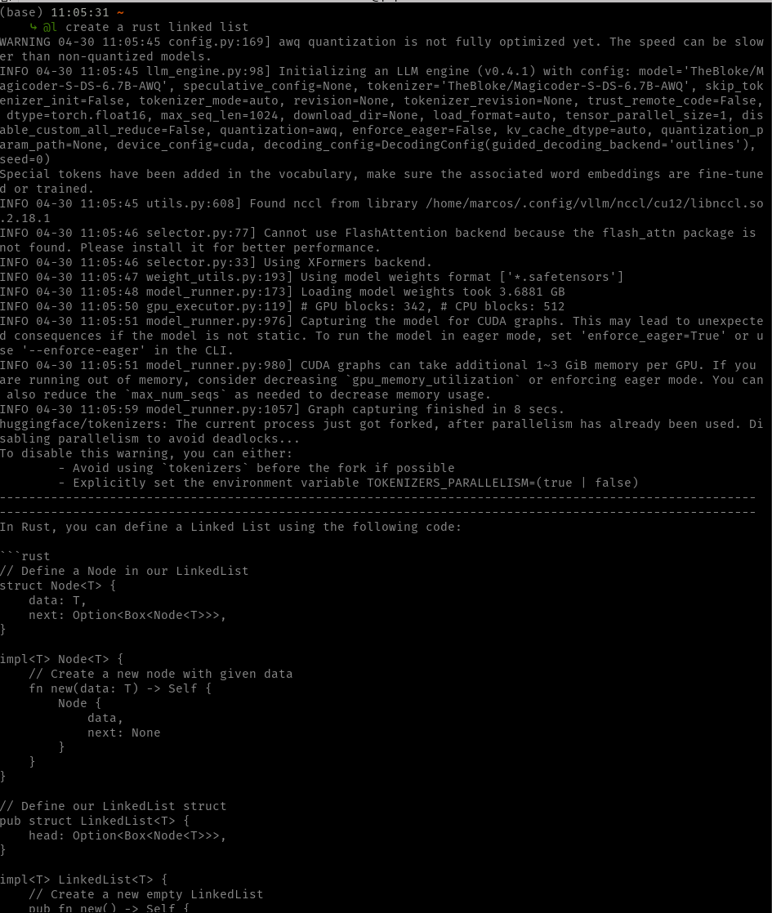

# Useful Local LLM Scripts

## Usage
```sh
# Usage:
function @l() {
    conda activate coder-slm
    python $HOME/path_to/local-llm/qwen.py $@
    conda deactivate
}

# Query LLM
@l "example of Python reduce function"
@l "linked list in Rust"
@l "how to center a div"

```




### Pre-Requisites
- GPU with at least 8GB
- miniconda
- conda environment with vllm installed

```sh
conda create -n coder-slm python=3.12 -y
conda activate coder-slm
pip install vllm
```